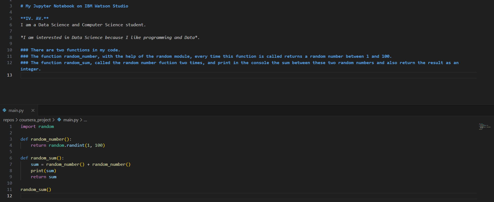

# coursera_project

# My Jupyter Notebook on IBM Watson Studio 

**IV. AV.** 
I am a Data Science and Computer Science student.

*I am interested in Data Science because I like programming and Data*.

### There are two functions in my code. 
### The function random_number, with the help of the random module, every time this function is called returns a random number between 1 and 100.
### The function random_sum, called the random number fuction two times, and print in the console the sum between these two random numbers and also return the result as an integer. 

